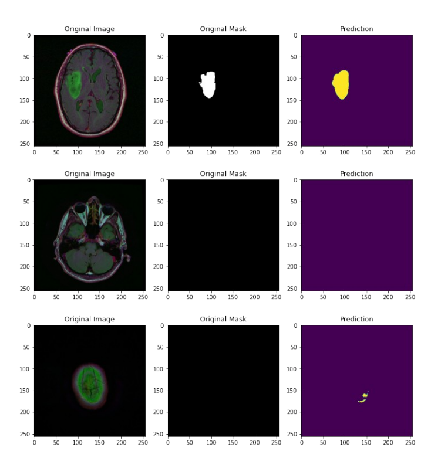
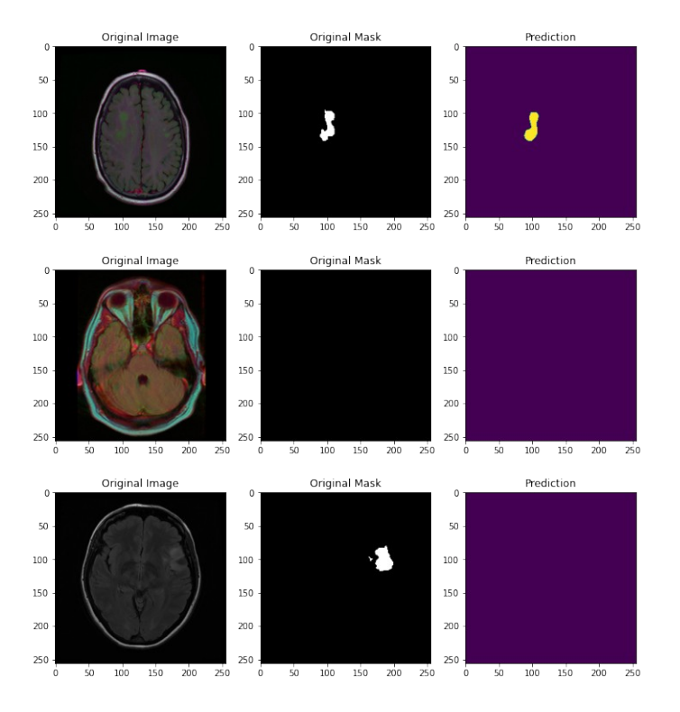
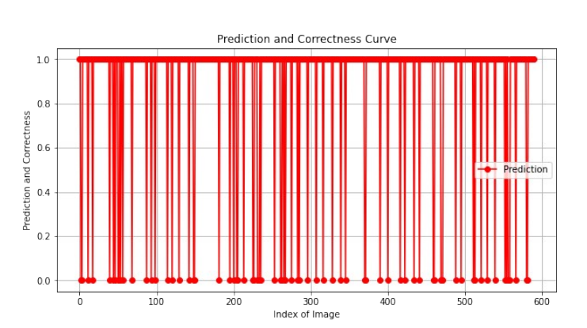
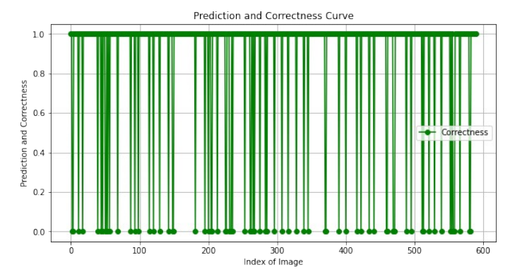

# TumorTrace

The TumorTrace project aims to develop an automated system for identifying and segmenting tumor regions in brain MRI images. Accurate segmentation is crucial for diagnosis, treatment planning, and monitoring of brain tumors. This project utilizes the U-Net architecture, a popular deep-learning model designed for image segmentation tasks, particularly in medical imaging.
Our goal is to provide a robust solution for automated tumor detection, which can significantly aid in clinical decision-making.
 

## Overview

This project involves several critical steps to ensure effective brain tumor segmentation. Below is a brief outline of the process:

# Steps for Brain Tumor Segmentation

1. **Data Preparation**: Collect MRI images and ground truth masks; preprocess (resize, normalize).
2. **Data Augmentation**: Enhance dataset with rotation, flipping, scaling, and noise.
3. **Dataset Splitting**: Divide into training, validation, and testing sets.
4. **Model Building**: Implement U-Net with encoder-decoder architecture.
5. **Loss Function**: Select suitable loss function (e.g., Dice loss).
6. **Training**: Train model on training set, monitor validation performance.
7. **Evaluation**: Assess performance on testing set using metrics like Dice coefficient.
8. **Post-processing**: Refine masks with morphological operations.
9. **Visualization**: Overlay results on original images.
10. **Deployment**: Deploy for clinical use or integrate into software.

## Working Architecture

## Curve and Plots

### Accuracy
Accuracy measures the proportion of correctly classified instances out of the total instances in a dataset. It provides a straightforward assessment of a model's performance, especially in balanced datasets.

### Loss
Loss quantifies the difference between predicted values and actual values during model training. A lower loss indicates better model performance, guiding the optimization process to improve predictions.

### Intersection over Union (IoU)
IoU is a metric used to evaluate the accuracy of object detection and segmentation models. It calculates the overlap between the predicted segmentation area and the ground truth area, with values ranging from 0 to 1, where 1 indicates perfect overlap.

## Result

The results of brain tumor segmentation typically include visualized segmented regions overlaid on original MRI images, allowing for clear identification of tumor boundaries. Metrics such as Dice coefficient and Intersection over Union (IoU) are used to quantify segmentation accuracy, often showing high scores that indicate effective model performance. Additionally, post-processing techniques can enhance the quality of the segmentation masks, improving clinical usability.

More output as above (in the file)

## Consclusion

In conclusion, using advanced models like U-Net, brain tumor segmentation demonstrates significant potential in enhancing diagnostic accuracy in medical imaging. The effectiveness of the segmentation can be visualized through overlaid images of predicted tumor regions against the ground truth, showcasing the model's ability to accurately delineate tumor boundaries. Evaluation metrics such as Dice coefficient and IoU provide quantitative measures of performance, reinforcing the model's reliability for clinical applications.

#Prediction

#Correctness

