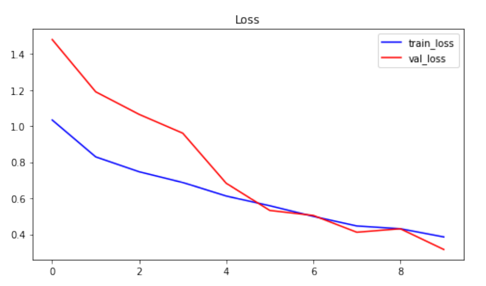
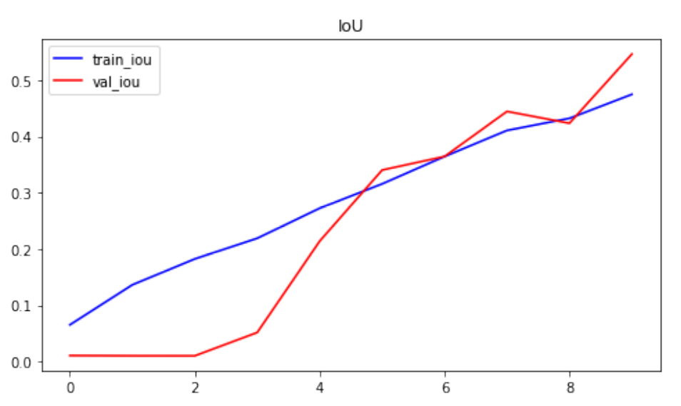
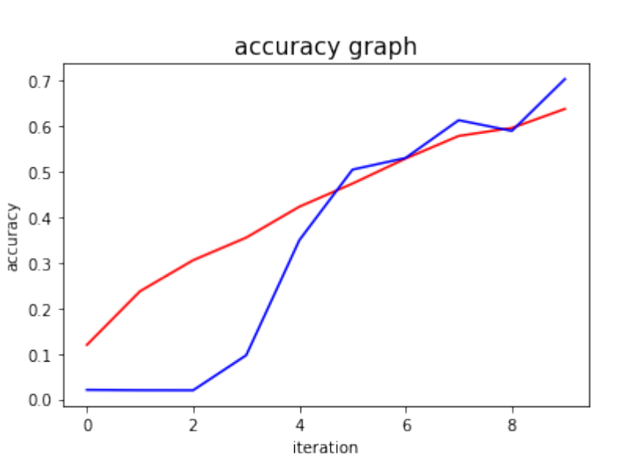

# TumorTrace

The TumorTrace project aims to develop an automated system for identifying and segmenting tumor regions in brain MRI images. Accurate segmentation is crucial for diagnosis, treatment planning, and monitoring of brain tumors. This project utilizes the U-Net architecture, a popular deep-learning model designed for image segmentation tasks, particularly in medical imaging.
Our goal is to provide a robust solution for automated tumor detection, which can significantly aid in clinical decision-making.
 

## Overview

This project involves several critical steps to ensure effective brain tumor segmentation. Below is a brief outline of the process:

# Steps for Brain Tumor Segmentation

1. **Data Preparation**: Collect MRI images and ground truth masks; preprocess (resize, normalize).
2. **Data Augmentation**: Enhance dataset with rotation, flipping, scaling, and noise.
3. **Dataset Splitting**: Divide into training, validation, and testing sets.
4. **Model Building**: Implement U-Net with encoder-decoder architecture.
5. **Loss Function**: Select suitable loss function (e.g., Dice loss).
6. **Training**: Train model on training set, monitor validation performance.
7. **Evaluation**: Assess performance on testing set using metrics like Dice coefficient.
8. **Post-processing**: Refine masks with morphological operations.
9. **Visualization**: Overlay results on original images.
10. **Deployment**: Deploy for clinical use or integrate into software.

## Working Architecture

## Curve and Plots

