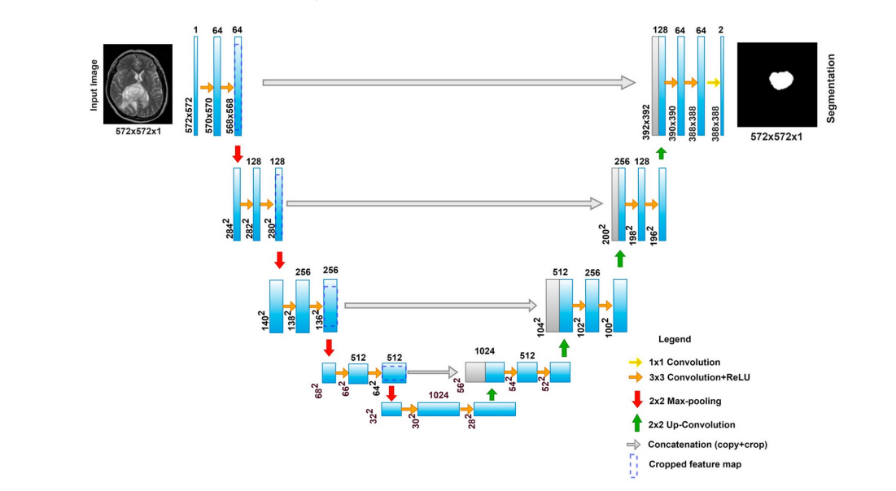
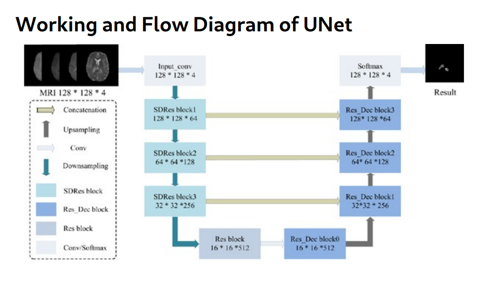

# TumorTrace

The TumorTrace project aims to develop an automated system for identifying and segmenting tumor regions in brain MRI images. Accurate segmentation is crucial for diagnosis, treatment planning, and monitoring of brain tumors. This project utilizes the U-Net architecture, a popular deep-learning model designed for image segmentation tasks, particularly in medical imaging.
Our goal is to provide a robust solution for automated tumor detection, which can significantly aid in clinical decision-making.
 

## Overview

This project involves several critical steps to ensure effective brain tumor segmentation. Below is a brief outline of the process:

### Steps to Perform Brain Tumor Segmentation

1. **Data Collection and Preparation**:
   - Gather a dataset of brain MRI images along with corresponding ground truth masks indicating tumor regions.
   - Preprocess the images (e.g., resizing, normalization) to ensure uniformity and enhance model performance.

2. **Data Augmentation**:
   - Augment the dataset to increase its size and diversity, improving the robustness and generalization of the model.
   - Common techniques include rotation, flipping, scaling, and adding noise to the images.

3. **Splitting the Dataset**:
   - Divide the dataset into training, validation, and testing sets. The training set is used for model training, the validation set for hyperparameter tuning, and the testing set for performance evaluation.

4. **Building the U-Net Model**:
   - Implement the U-Net architecture, consisting of an encoder (downsampling path) and a decoder (upsampling path) connected by skip connections.
   - Use convolutional layers with appropriate activation functions (e.g., ReLU), pooling layers (e.g., max pooling), and upsampling layers (e.g., transposed convolution) to build the network.

5. **Loss Function Selection**:
   - Choose an appropriate loss function to train the model. Common choices for binary segmentation include binary cross-entropy loss, Dice loss, and Jaccard loss.

6. **Training the Model**:
   - Train the U-Net model on the training dataset using the selected loss function and an optimization algorithm (e.g., Adam optimizer).
   - Monitor performance on the validation set and adjust hyperparameters to improve results and prevent overfitting.

7. **Evaluation**:
   - Evaluate the trained model on the testing set to assess its segmentation performance.
   - Compute metrics such as Dice coefficient, Jaccard index, sensitivity, specificity, and accuracy.

8. **Post-processing**:
   - Apply post-processing techniques (e.g., morphological operations like dilation and erosion) to refine segmentation masks and enhance results.

9. **Visualization**:
   - Visualize the segmented tumor regions overlaid on original MRI images to inspect the quality of the segmentation results.

10. **Deployment**:
    - Deploy the trained model for practical use, automating tumor segmentation in clinical settings or integrating it into medical image analysis software.

## Working Architecture

